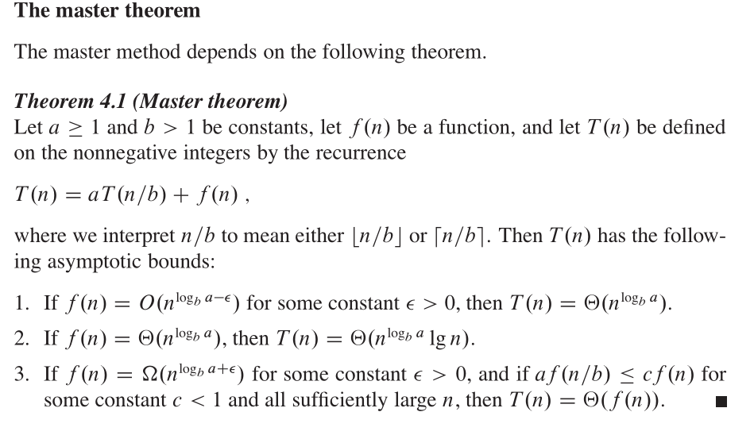

## 分治策略
递归的，每层递归都包含以下步骤
- 分解
- 解决
- 合并

## 用递归解决两个问题
- 求解最大子数组问题

  求出一个子数组，使它的和加起来最大.需要思考为什么用分治方法可以
使他的和加起来最大。首先分的复杂度是n,而找出中间的那一种的复杂度
也是n

- 求解n x n矩阵乘法问题

## 求解算法渐进界的方法
- 代入法
- 递归树法
- 主方法：T(n) = aT(n/b) + f(n), 其中a>=1, b>1,f(n)是一个给定的函数。
刻画的算法：生成a个子问题，每个子问题的规模是原问题规模的1/b,分解和合并
步骤总共花费时间为f(n)

### 经常可以忽略的细节
- 初始值
- 向上取整，向下取整

